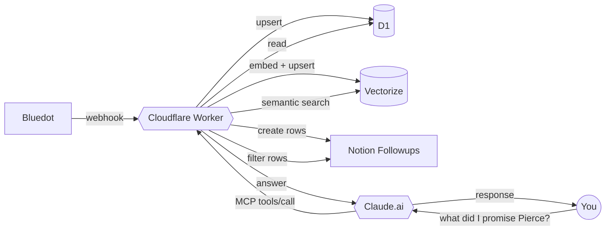

# aftercall

> Search and ask questions about your meetings using AI.
>
> After a video call, aftercall automatically saves the summary, the full transcript, and any action items. Then you can ask Claude things like _"What did I agree to do for Sarah?"_ or _"What meetings mentioned the budget?"_ — and get real answers back.
>
> Every to-do from your calls drops into a Notion checklist so nothing falls through the cracks.
>
> **Ongoing cost:** ~$5/mo for hosting + a fraction of a cent per call for AI processing. Needs a Bluedot account (free trial) to record your calls.

```
 Bluedot call ──▶ Worker ──▶ D1 + Vectorize + Notion ──▶ Claude.ai (MCP)
   webhook       extract       indexed storage          you ask questions
```



---

## What you get

Every Bluedot recording becomes:

1. **A D1 row** — `transcripts` table, idempotent on `video_id`, holding raw text + structured summary + participants + action items.
2. **Embedded chunks** in Cloudflare Vectorize (1536d, cosine) for semantic search.
3. **A Notion Transcripts row** — metadata hub (Date, Participants, Recording URL, link to Bluedot's native summary page). No duplicated summary content — Bluedot's own Notion sync owns that.
4. **One Followup row per action item** in a Notion inbox — `Status = Inbox`, linked via a `Meeting` relation back to the Transcripts row, ready to triage.
5. **MCP access from Claude.ai** — tools for semantic search, recurring-meeting lookup, per-call Q&A (RAG), detail lookup, followups, and owner-scoped action items.

Then you ask Claude.ai things like:

- _"What did I commit to do for Pierce in the last week?"_
- _"In my IT hiring call, what starting compensation did we agree on?"_
- _"Find every action item assigned to Andy since March."_
- _"Summarize my open Bluedot followups."_
- _"What calls mention IronRidge?"_

---

## Setup (10 minutes)

### Prerequisites

| Service | Tier | Purpose |
|---------|------|---------|
| [Cloudflare](https://dash.cloudflare.com) | Workers free + Vectorize paid (~$5/mo) | Hosting + D1 + Vectorize + KV |
| [OpenAI](https://platform.openai.com) | Pay-as-you-go (~$0.001/call) | Extraction (`gpt-5-mini`) + embeddings (`text-embedding-3-small`) |
| [Notion](https://notion.so) + [integration](https://www.notion.so/profile/integrations) | Free | Transcript pages + Followups inbox |
| [Bluedot](https://bluedothq.com) | Trial | Source of meeting recordings |
| [GitHub OAuth App](https://github.com/settings/developers) | Free | MCP auth (optional — only if connecting Claude.ai) |
| [Claude.ai](https://claude.ai) | Free/paid | MCP client (optional) |

### Run the setup script

```bash
git clone https://github.com/jchu96/aftercall.git
cd aftercall
npm install
npx wrangler login
npm run setup
```

The script walks 10 interactive steps:

1. Verify `wrangler` auth
2. Provision D1 database (idempotent — reuses existing)
3. Provision Vectorize index
4. Write bindings to `wrangler.toml` + apply D1 migrations
5. Create (or reuse) Notion Followups + Call Transcripts databases
6. Validate OpenAI API key
7. Write `.dev.vars` + update `wrangler.toml` vars
8. Register GitHub OAuth App (opens browser, auto-detects your worker URL) + configure MCP KV + allowlist
9. Push every secret to Cloudflare (no manual `wrangler secret put` dance)
10. `wrangler deploy`

Re-runs are safe — the script detects existing values and offers to reuse them instead of recreating.

### Set the Bluedot webhook

After deploy, the script prints your worker URL. In Bluedot:

- **Settings → Webhooks → Add endpoint**
- URL: `https://<your-worker>.workers.dev/`
- Events: `meeting.transcript.created`, `meeting.summary.created`

Bluedot shows a signing secret. Save it:

```bash
npx wrangler secret put BLUEDOT_WEBHOOK_SECRET
```

### Connect Claude.ai (optional, MCP)

- Claude.ai → **Settings → Connectors** → add a custom MCP server
- URL: `https://<your-worker>.workers.dev/mcp`
- Sign in with GitHub; the Worker checks your username against `ALLOWED_USERS` and hands Claude a bearer token

Done. Ask Claude about your calls.

Full OAuth + Bluedot + debug walkthrough: [`docs/auth.md`](./docs/auth.md).

---

## MCP tools reference

| Tool | What it does |
|------|---|
| [`search_calls(query, limit?)`](./docs/tools.md#search_calls) | Semantic search over all transcripts via OpenAI embeddings + Vectorize |
| [`get_call(video_id)`](./docs/tools.md#get_call) | Full details of one call: summary, participants, action items |
| [`answer_from_transcript(video_id, question)`](./docs/tools.md#answer_from_transcript) | RAG over a single call — drill-down Q&A grounded in that meeting's transcript |
| [`list_followups(status?, source?, limit?)`](./docs/tools.md#list_followups) | Query the Notion Followups DB with select filters |
| [`capture_thought(dump, ...)`](./docs/tools.md#capture_thought) | Queue dictated thought dumps and project updates for local Obsidian sync |
| [`list_meetings(series, from?, to?, limit?)`](./docs/tools.md#list_meetings) | List recurring meetings by explicit series and local meeting date |
| [`list_commitments(series, from?, to?, person?, limit?)`](./docs/tools.md#list_commitments) | List extracted action items from a recurring meeting series/date range |
| [`find_action_items_for(person, since?)`](./docs/tools.md#find_action_items_for) | All action items assigned to a person (substring match on owner) |
| [`recent_calls(days?)`](./docs/tools.md#recent_calls) | Last N days of calls, newest first |

Sample prompts per tool: [`docs/tools.md`](./docs/tools.md).

---

## Local Obsidian notes intake

aftercall can also sit next to a local Obsidian vault for personal note dumps.
This path is local-only: Codex organizes the messy input, then
`scripts/obsidian-intake.ts` writes Obsidian Markdown into your vault.

```bash
export OBSIDIAN_VAULT="$HOME/path/to/your/Obsidian Vault"
npm run notes:intake -- --bootstrap
pbpaste | npm run notes:intake -- --title "Planning dump"
```

Details and the structured Codex plan format: [`docs/obsidian-intake.md`](./docs/obsidian-intake.md).

---

## Local Obsidian vault backup

Deborah can back up a local Obsidian vault to Cloudflare R2 through the Worker.
The local script uploads changed files to `POST /vault/sync`; the Worker stores
raw file bodies in R2 and a manifest in D1.

```bash
export DEBORAH_WORKER_URL="https://aftercall.pierce-9df.workers.dev"
export VAULT_SYNC_TOKEN="<same value as VAULT_SYNC_SECRET>"
npm run vault:backup
```

Details: [`docs/obsidian-backup.md`](./docs/obsidian-backup.md).

---

## Obsidian note inbox sync

Deborah can queue dictated thoughts and project updates from MCP clients, then a
local sync command writes them into the Obsidian vault.

```bash
export DEBORAH_WORKER_URL="https://aftercall.pierce-9df.workers.dev"
npm run notes:sync
```

Details: [`docs/note-inbox-sync.md`](./docs/note-inbox-sync.md).

---

## Architecture

Three flows compose the system. Each has its own diagram and runbook:

- **Ingestion** — Bluedot webhook → OpenAI extraction + embeddings → D1 + Vectorize + Notion ([diagram](./docs/architecture.md#1-ingestion-pipeline))
- **OAuth** — Claude.ai → Worker `/authorize` → GitHub → Worker `/auth/github/callback` → Claude.ai ([diagram](./docs/architecture.md#2-oauth-flow-claudeai-↔-github))
- **Query** — Claude.ai → bearer-protected `/mcp` → tool dispatch → storage → response ([diagram](./docs/architecture.md#3-mcp-query-path))

Deep-dive: [`docs/architecture.md`](./docs/architecture.md).

---

## Stack

| Layer | Tech |
|-------|------|
| Webhook + MCP | Cloudflare Workers + Hono |
| Transcript store | Cloudflare D1 (SQLite, Drizzle schema) |
| Embeddings | Cloudflare Vectorize (1536d, cosine, HNSW) |
| LLM | OpenAI — `gpt-5-mini` (extraction, json_schema) + `text-embedding-3-small` |
| Output | Notion API (direct `fetch` — **not** `@notionhq/client`) |
| MCP transport | `@modelcontextprotocol/sdk` Streamable HTTP, stateless mode |
| MCP auth | `@cloudflare/workers-oauth-provider` + GitHub OAuth |

**Not in the stack:** Anthropic, Neon, Postgres, Redis, SendGrid, Express. One LLM provider, one Notion integration, one GitHub OAuth App.

---

## Testing

```bash
npx vitest run       # 110 tests, real D1 via miniflare
npx vitest           # watch mode
npx tsc --noEmit     # typecheck
```

Tests cover Svix verification, payload normalization, OpenAI extraction (mocked), embeddings chunking, D1 idempotency with a **concurrent-retry race test**, Vectorize upsert, Notion page builders, the GitHub OAuth handler + allowlist, the full OAuth provider integration (well-known metadata, `WWW-Authenticate` on 401, bearer revocation), and every MCP tool's business logic against real D1 + mocked OpenAI/Vectorize/Notion.

End-to-end MCP transport (`tools/list`, `tools/call` through Streamable HTTP) is validated by live Claude.ai smoke tests — vitest-pool-workers' ESM shim can't resolve the SDK's `ajv` JSON import.

---

## CI/CD

GitHub Actions runs typecheck + tests on pull requests and deploys the
Cloudflare Worker on pushes to `main`. The deploy job generates the gitignored
`wrangler.toml` from repository variables, validates the Worker bundle, applies
D1 migrations, and then runs `npm run deploy`.

Setup details: [`docs/github-actions.md`](./docs/github-actions.md).

---

## Operating

| Task | Command |
|------|---------|
| Tail live logs | `npx wrangler tail` |
| Deploy | `npx wrangler deploy` |
| Inspect D1 | `npx wrangler d1 execute aftercall-db --remote --command "SELECT ..."` |
| Query Vectorize | `npx wrangler vectorize get-by-ids aftercall-vectors --ids "1-0,1-1"` |
| Reprocess a call | `DELETE FROM transcripts WHERE video_id = '...'` then refire Bluedot webhook |
| List KV (OAuth) | `npx wrangler kv key list --binding OAUTH_KV` |
| Revoke your bearer | `curl -X POST https://.../auth/revoke -H "Authorization: Bearer <token>"` |

Full runbook: [`docs/architecture.md#operational-runbook`](./docs/architecture.md#operational-runbook).

---

## Environment variables

<details>
<summary>Full reference (click to expand)</summary>

Set via `wrangler.toml` `[vars]` for non-secret config and `wrangler secret put` for secrets. `.dev.vars` mirrors secrets for local `wrangler dev`.

### Secrets

| Variable | Required | Notes |
|----------|----------|-------|
| `OPENAI_API_KEY` | yes | Extraction + embeddings |
| `NOTION_INTEGRATION_KEY` | yes | Notion integration token (`ntn_...`) |
| `BLUEDOT_WEBHOOK_SECRET` | yes | Svix signing secret from Bluedot's webhook config |
| `GITHUB_CLIENT_ID` | MCP only | GitHub OAuth App client id |
| `GITHUB_CLIENT_SECRET` | MCP only | GitHub OAuth App client secret |
| `SENTRY_DSN` | optional | Enables error tracking + pipeline tracing. Leave unset to disable Sentry entirely. |

### Vars (`wrangler.toml`)

| Variable | Default | Notes |
|----------|---------|-------|
| `OPENAI_EXTRACTION_MODEL` | `gpt-5-mini` | Override to upgrade |
| `NOTION_TRANSCRIPTS_DATA_SOURCE_ID` | — | Set by setup script |
| `NOTION_FOLLOWUPS_DATA_SOURCE_ID` | — | Set by setup script |
| `BASE_URL` | — | Public worker origin; used for OAuth callback URL construction |
| `ALLOWED_USERS` | — | Comma-separated GitHub usernames allowed via MCP |
| `SENTRY_ENVIRONMENT` | `production` | Only read when `SENTRY_DSN` is set |
| `SENTRY_RELEASE` | auto | Injected by `npm run deploy` when Sentry is configured |

### Bindings

| Binding | Type | Purpose |
|---------|------|---------|
| `DB` | D1 | Transcripts |
| `VECTORIZE` | Vectorize | Chunk embeddings |
| `OAUTH_KV` | KV | OAuth state + tokens (MCP only) |

### Compatibility flags

| Flag | Why |
|------|-----|
| `nodejs_compat` | Bluedot's Svix package needs Node APIs |
| `global_fetch_strictly_public` | Required by `@cloudflare/workers-oauth-provider` |

</details>

---

## Repo layout

<details>
<summary>File-by-file (click to expand)</summary>

```
src/
├── index.ts                  # Worker entry — re-exports OAuthProvider
├── handler.ts                # ingestion pipeline orchestration
├── env.ts                    # typed Env (D1, Vectorize, KV, secrets)
├── webhook-verify.ts         # Svix signature verification
├── bluedot.ts                # Bluedot payload normalization
├── extract.ts                # OpenAI structured extraction
├── embeddings.ts             # OpenAI embeddings + chunking
├── d1.ts                     # transcripts table writes
├── vectorize.ts              # Vectorize upserts
├── notion.ts                 # Notion API (transcript pages, followups)
├── schema.ts                 # Drizzle SQLite schema
├── logger.ts                 # structured JSON logging
└── mcp/
    ├── index.ts              # OAuthProvider wiring + Hono default app
    ├── handler.ts            # /mcp API handler (bearer required)
    ├── tools.ts              # McpServer + Streamable HTTP transport
    ├── auth/
    │   ├── github.ts         # /authorize + /auth/github/callback
    │   └── allowlist.ts      # case-insensitive username check
    └── tools/
        ├── search_calls.ts
        ├── get_call.ts
        ├── list_followups.ts
        ├── find_action_items_for.ts
        └── recent_calls.ts

scripts/
├── setup.ts                  # 10-step interactive provisioning
├── smoke-vectorize.ts        # Vectorize round-trip smoke test
└── migrate-from-neon.ts      # historical Neon → D1 migration

drizzle/                      # numbered SQL migrations
docs/
├── architecture.md           # three flows + data model + decisions + runbook
├── tools.md                  # MCP tool reference with sample prompts
└── auth.md                   # GitHub OAuth setup + troubleshooting
test/                         # vitest helpers + ProvidedEnv typing
```

</details>

---

## Observability (optional)

The Worker ships with [`@sentry/cloudflare`](https://docs.sentry.io/platforms/javascript/guides/cloudflare/) integration for error tracking + pipeline performance tracing. It's **fully optional** — leave `SENTRY_DSN` unset and the SDK is a no-op.

**Enable it** (your own fork, your own Sentry project):

```bash
# 1. Add DSN as a secret
npx wrangler secret put SENTRY_DSN

# 2. (optional) enable source map uploads on deploy
#    - export SENTRY_AUTH_TOKEN from https://sentry.io/settings/account/api/auth-tokens/
#    - override defaults in scripts/deploy.mjs (SENTRY_ORG, SENTRY_PROJECT envs)
SENTRY_ORG=my-org SENTRY_PROJECT=my-project SENTRY_AUTH_TOKEN=sntrys_... npm run deploy
```

What's instrumented:
- **Pipeline spans** — `bluedot.pipeline.{transcript,summary}` wrap the webhook handlers, with child spans for `openai.extract`, `openai.embed`, `d1.upsert_*`, `vectorize.upsert`, `notion.create_transcript_page`, `notion.create_followup`.
- **Error capture** — every pipeline catch site calls `Sentry.captureException` with `video_id` + `svix_id` tags. Notion failures are non-fatal but still reported.
- **MCP + OAuth errors** — `withSentry` wraps the worker entrypoint so any uncaught error in the OAuth or MCP paths auto-reports.
- **Source maps** — `npm run deploy` uploads them to Sentry automatically when `.sentryclirc` or `SENTRY_AUTH_TOKEN` is present; otherwise the step is skipped with a warning.

Without Sentry configured, `npm run deploy` just runs `wrangler deploy` as before.

---

## Documentation

| Doc | Read when |
|-----|-----------|
| [`docs/architecture.md`](./docs/architecture.md) | Understanding the system, adding features, debugging |
| [`docs/tools.md`](./docs/tools.md) | Using MCP tools from Claude.ai, adding a new tool |
| [`docs/auth.md`](./docs/auth.md) | First-time OAuth setup, troubleshooting 401/403/redirect_uri errors |
| [`CHANGELOG.md`](./CHANGELOG.md) | What changed between versions |
| [`CLAUDE.md`](./CLAUDE.md) | Conventions + do-nots when using Claude Code in this repo |
| [`conductor/`](./conductor/) | Product definition, tech stack, workflow, and track specs — the "why" behind the code |

---

## Roadmap

Not promises — just ideas on the shortlist. File an issue if you want to prioritize one.

- **`delete_call(video_id)` MCP tool** — let Claude.ai prune unwanted calls end-to-end:
  - Delete the D1 `transcripts` row
  - Delete the matching Vectorize chunks (by deterministic `{id}-{chunk}` IDs)
  - Archive the aftercall Transcripts page + every Followup row related via the `Meeting` relation (unlink before archive, or Notion will orphan the relation)
  - Leave Bluedot's native Notion summary page alone — it's Bluedot's surface, not ours
  - Needs a confirmation / dry-run guard before landing, since the tool is destructive and Claude can call it without a human in the loop.

---

## License

MIT — see [LICENSE](./LICENSE).
