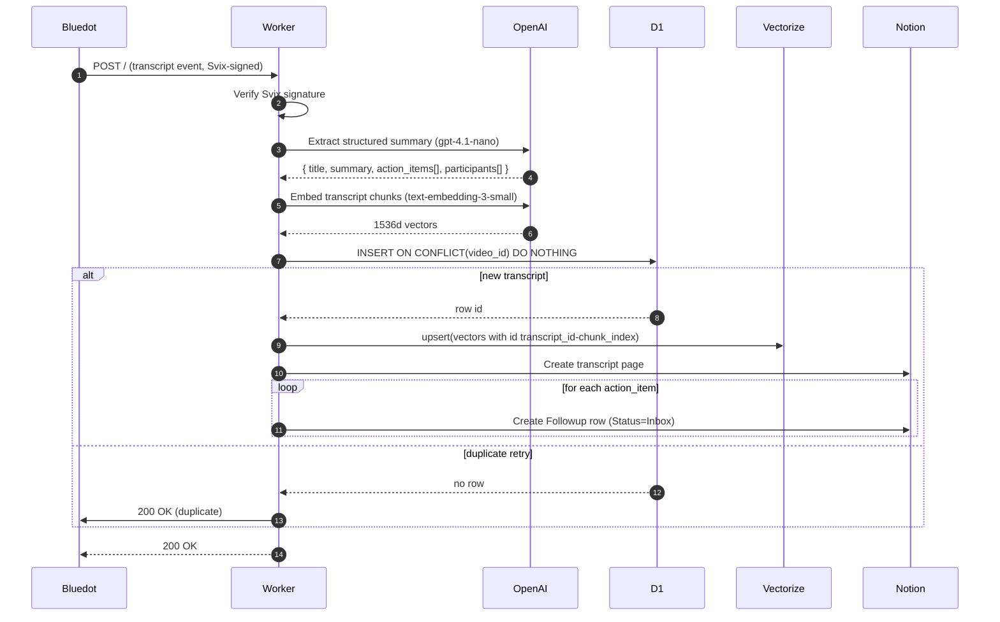

# bluedot-rag

> **Auto-ingest [Bluedot](https://bluedothq.com) meeting transcripts into Cloudflare D1 + Vectorize, route action items into a Notion Followups inbox, and query everything from Claude.ai via MCP.**
>
> One Cloudflare Worker, one OpenAI key, one Notion integration, one GitHub OAuth App. ~10 minutes from clone to first ingested call; another ~5 minutes to connect Claude.ai.

---

## What this does

Every time you record a meeting in Bluedot, this Worker:

1. Receives the webhook (Svix-verified)
2. Sends the transcript to OpenAI (`gpt-4.1-nano` for structured extraction, `text-embedding-3-small` for vectors)
3. Stores the transcript in Cloudflare **D1** with a unique constraint on the meeting id (idempotent against retries)
4. Upserts chunked embeddings into Cloudflare **Vectorize** for future RAG queries
5. Creates a Notion page in your **Call Transcripts** database (summary, participants, action items)
6. Creates one row per action item in your Notion **Followups** database with `Status = Inbox`

The Followups database is the actual product — a triagable inbox of every commitment from every call. No more "what did I promise to do?" — it's already in your inbox.

On top of the ingestion pipeline, an **MCP (Model Context Protocol) server** lets you query your indexed calls from Claude.ai in natural language:

- _"What did I commit to do for Pierce last week?"_
- _"Summarize my open followups from Bluedot calls."_
- _"Find all action items owned by Andy since March."_

Access is gated by GitHub OAuth + a username allowlist (single-user by default — friends fork to host their own).

---

## Stack

| Layer | Technology |
|-------|------------|
| Webhook + processing | Cloudflare Workers |
| Transcript storage | Cloudflare D1 (SQLite) |
| Embeddings | Cloudflare Vectorize (1536d, cosine) |
| Action item extraction | OpenAI `gpt-4.1-nano` (structured outputs) |
| Vector embeddings | OpenAI `text-embedding-3-small` |
| Output surface | Notion API |
| Source | Bluedot webhooks (Svix-signed) |
| MCP auth | `@cloudflare/workers-oauth-provider` + GitHub OAuth |
| MCP transport | `@modelcontextprotocol/sdk` Streamable HTTP (stateless) |

**No Anthropic, no Neon, no SendGrid required.** Single OpenAI key + single Notion integration + one GitHub OAuth App.

---

## Architecture



For the MCP query path (Claude.ai → OAuth → tool call → response), see [docs/architecture.md](./docs/architecture.md).

---

## 5-minute setup

### Prerequisites

| Service | Free tier | Why |
|---------|-----------|-----|
| [Cloudflare](https://dash.cloudflare.com) | Yes (Workers free, Vectorize requires paid plan ~$5/mo) | Hosting + storage + vectors |
| [OpenAI](https://platform.openai.com) | $5 credit, then ~$0.001/call | Extraction + embeddings |
| [Notion](https://notion.so) + [integration](https://www.notion.so/profile/integrations) | Yes | Output databases |
| [Bluedot](https://bluedothq.com) | Trial available | Meeting recordings |
| [GitHub OAuth App](https://github.com/settings/developers) | Yes | MCP auth (optional — only needed if you want to query from Claude.ai) |
| [Claude.ai](https://claude.ai) | Yes | MCP client (optional) |

### Setup

```bash
# 1. Clone
git clone https://github.com/jchu96/bluedot-rag.git
cd bluedot-rag
npm install

# 2. Authenticate with Cloudflare
npx wrangler login

# 3. Run the interactive setup
#    (creates D1, Vectorize, both Notion DBs; writes .dev.vars + wrangler.toml)
npm run setup

# 4. Deploy
npx wrangler deploy

# 5. Set production secrets (the values you used in setup, sent to Cloudflare)
npx wrangler secret put OPENAI_API_KEY
npx wrangler secret put NOTION_INTEGRATION_KEY

# 6. In Bluedot:
#    Settings → Webhooks → Add endpoint
#    URL = your worker URL (printed by `wrangler deploy`)
#    Subscribe to: meeting.transcript.created
#    Bluedot will give you a signing secret. Then:
npx wrangler secret put BLUEDOT_WEBHOOK_SECRET

# 7. Test by recording a Bluedot meeting; check logs:
npx wrangler tail
```

### Notion integration prep

Before running `npm run setup` you need:

1. Create an integration: https://www.notion.so/profile/integrations → "New integration" → Internal
2. Copy the integration token (starts with `ntn_`)
3. In your Notion workspace, create a parent page (e.g. "Bluedot RAG") for the new databases
4. On that parent page → ⋯ menu → "Add Connections" → select your integration
5. Get the parent page ID: it's the 32-char hex in the page URL after the title

The setup script will prompt for both the token and the parent page ID.

---

## Environment variables

| Variable | Type | Description |
|----------|------|-------------|
| `OPENAI_API_KEY` | secret | OpenAI key for extraction + embeddings |
| `NOTION_INTEGRATION_KEY` | secret | Notion integration token (`ntn_...`) |
| `BLUEDOT_WEBHOOK_SECRET` | secret | Svix signing secret from Bluedot's webhook config |
| `OPENAI_EXTRACTION_MODEL` | var | Default `gpt-4.1-nano`; override to upgrade later |
| `NOTION_TRANSCRIPTS_DATA_SOURCE_ID` | var | Set by setup script |
| `NOTION_FOLLOWUPS_DATA_SOURCE_ID` | var | Set by setup script |
| `GITHUB_CLIENT_ID` | secret | GitHub OAuth App client id (MCP only) |
| `GITHUB_CLIENT_SECRET` | secret | GitHub OAuth App client secret (MCP only) |
| `ALLOWED_USERS` | var | Comma-separated GitHub usernames allowed to connect via MCP |
| `BASE_URL` | var | Public worker origin (e.g. `https://bluedot-rag.<account>.workers.dev`) |

Local dev: `.dev.vars` (gitignored). Production: `wrangler secret put` for secrets, `wrangler.toml` `[vars]` for non-secret config.

Additional bindings (MCP only):

| Binding | Type | Purpose |
|---------|------|---------|
| `OAUTH_KV` | KV namespace | Stores OAuth authorization state (5-min TTL) + issued tokens |

---

## Repo layout

```
src/
├── index.ts            # fetch entry — re-exports OAuth-wrapped worker
├── handler.ts          # ingestion pipeline orchestration
├── env.ts              # Env interface (D1, Vectorize, KV, secrets)
├── webhook-verify.ts   # Svix signature verification
├── bluedot.ts          # Bluedot payload normalization
├── extract.ts          # OpenAI structured extraction
├── embeddings.ts       # OpenAI embeddings + chunking
├── d1.ts               # D1 transcripts table writes
├── vectorize.ts        # Vectorize upserts
├── notion.ts           # Notion API (transcript pages + followup rows)
├── schema.ts           # Drizzle SQLite schema
├── logger.ts           # Structured JSON logging
└── mcp/                # MCP server + OAuth
    ├── index.ts                # OAuthProvider wiring, Hono default app
    ├── handler.ts              # /mcp API handler (bearer required)
    ├── tools.ts                # McpServer + Streamable HTTP transport
    ├── auth/
    │   ├── github.ts           # /authorize + /auth/github/callback
    │   └── allowlist.ts        # case-insensitive username check
    └── tools/
        ├── search_calls.ts     # Vectorize semantic search
        ├── get_call.ts         # D1 transcript lookup
        ├── list_followups.ts   # Notion Followups DB query
        ├── find_action_items_for.ts  # json_each over action_items
        └── recent_calls.ts     # recent D1 rows

scripts/
├── setup.ts            # Interactive provisioning (now incl. MCP OAuth)
└── smoke-vectorize.ts  # Vectorize round-trip smoke test

drizzle/                # Numbered SQL migrations
docs/                   # Architecture, tools reference, auth guide
test/                   # Test setup helpers + ProvidedEnv typing
```

---

## Testing

```bash
# All tests (uses @cloudflare/vitest-pool-workers — real D1 in miniflare)
npx vitest run

# Watch mode
npx vitest

# Typecheck
npx tsc --noEmit
```

Tests cover Svix verification, payload normalization, OpenAI extraction (mocked), embeddings chunking, D1 idempotency, Vectorize upsert, Notion page builders, full handler flows (incl. a **dedup race test**), MCP auth (GitHub OAuth handler + allowlist + OAuth provider integration: `.well-known/*`, 401 WWW-Authenticate, bearer revocation), and each MCP tool's business logic against real D1 + mocked OpenAI/Vectorize/Notion.

End-to-end MCP transport (`tools/list` + `tools/call` through Streamable HTTP) is exercised live via Claude.ai — vitest-pool-workers' ESM shim can't resolve the `ajv` JSON import pulled in by `@modelcontextprotocol/sdk`, so full-pipeline MCP integration is covered by manual smoke tests rather than automated.

---

## Operational notes

| Operation | How |
|-----------|-----|
| Tail live logs | `npx wrangler tail` |
| Reprocess a meeting | `DELETE FROM transcripts WHERE video_id = '...'` then re-fire from Bluedot's "Export to Webhook" |
| Check D1 contents | `npx wrangler d1 execute bluedot-rag-db --remote --command "SELECT id, video_id, title FROM transcripts ORDER BY id DESC LIMIT 10"` |
| List Vectorize entries | `npx wrangler vectorize get-by-ids bluedot-rag-vectors --ids "1-0,1-1"` |
| Replay a Svix event | Find the message in Bluedot's Svix dashboard, click Replay |

---

## Troubleshooting

**Notion 401/404 during setup:** the integration isn't shared with the parent page. Open the page → ⋯ → Add Connections → select your integration.

**Vectorize binding error in `wrangler dev`:** ensure `remote = true` is set on the binding in `wrangler.toml`.

**`Cannot read properties of undefined (reading 'call')` from Notion calls:** you imported the `@notionhq/client` SDK. Use direct `fetch` instead — the SDK doesn't work in workerd.

**OpenAI returns nulls in optional fields:** strict json_schema mode requires all properties be in `required`. We handle this in `cleanResult()` (extract.ts).

**MCP: Claude.ai says "couldn't connect":** check that `BASE_URL` in `wrangler.toml` matches your actual worker origin and that the GitHub OAuth App's callback URL ends in `/auth/github/callback`. See [docs/auth.md](./docs/auth.md) for the full troubleshooting tree.

**MCP: 403 after GitHub sign-in:** your GitHub username isn't in `ALLOWED_USERS`. Update `wrangler.toml` and `wrangler deploy` again.

**MCP: `/mcp` returns 401 with `WWW-Authenticate: Bearer resource_metadata=...`:** that's expected — Claude.ai reads the `resource_metadata` URL to discover the OAuth endpoints and restart the flow.

---

## Connect to Claude.ai

Once deployed, add the MCP server to Claude.ai so you can query your calls in natural language.

1. Open [Claude.ai → Settings → Connectors](https://claude.ai/settings/connectors) (or the equivalent in your workspace).
2. Add a custom MCP server with URL: `https://<your-worker>.workers.dev/mcp`
3. Claude.ai will redirect you to GitHub. Sign in; GitHub asks if you authorize the "bluedot-rag MCP" app.
4. GitHub redirects back; the worker checks your username against `ALLOWED_USERS`, mints a bearer token, and sends you back to Claude.ai.
5. You should now see the 5 tools available in Claude.ai's tool picker. Try:
   - "Search my calls for IronRidge."
   - "Show me open followups from Bluedot."
   - "What action items are assigned to Andy?"

Full MCP tool reference: [docs/tools.md](./docs/tools.md).
OAuth + GitHub App setup: [docs/auth.md](./docs/auth.md).

---

## Predecessor

This Worker evolved from a Neon-based prototype. See [REDACTED/docs/bluedot-pipeline.md](https://github.com/jchu96/REDACTED/blob/main/docs/bluedot-pipeline.md) for that earlier architecture.

---

## License

MIT — see [LICENSE](./LICENSE).
