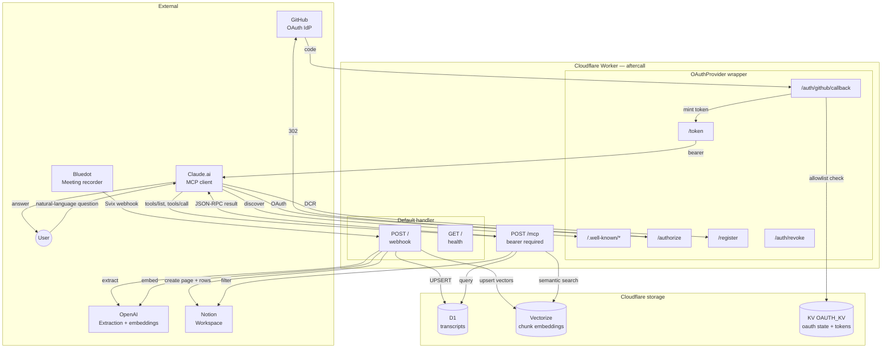
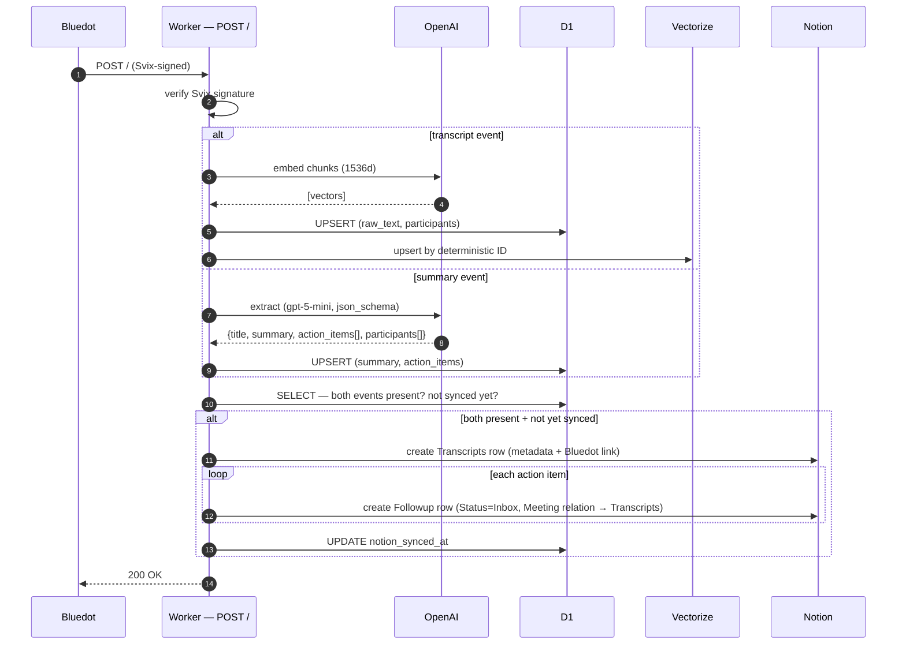
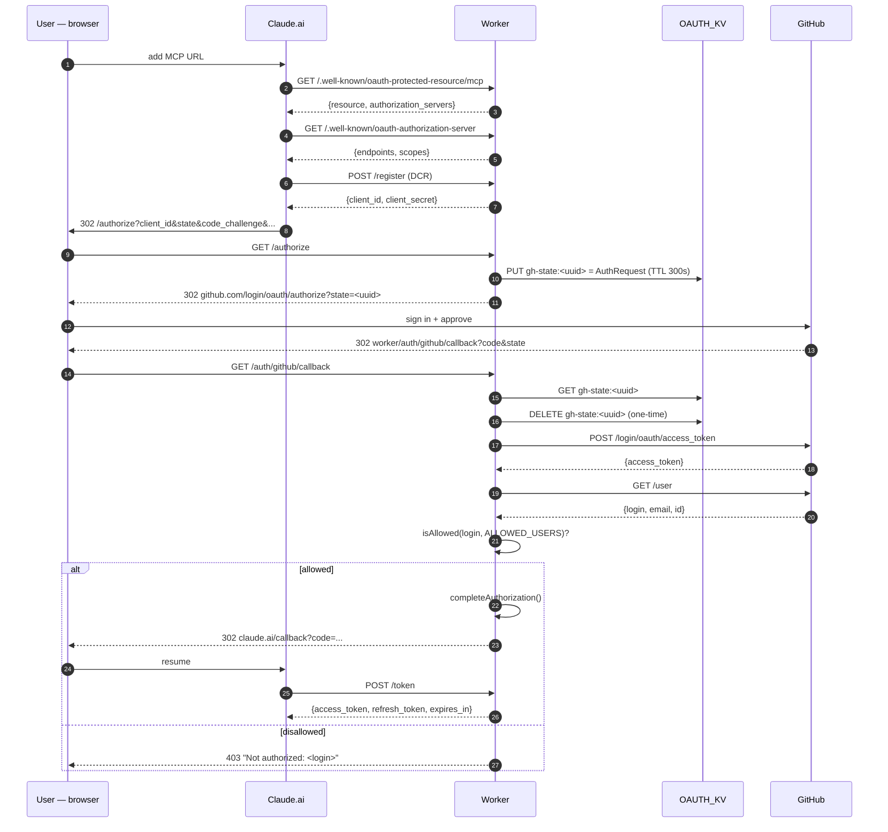
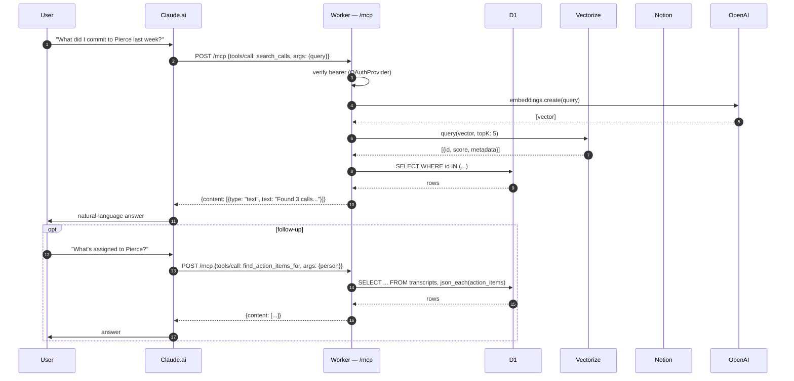

# Architecture

This doc is the "how does this actually work" reference. It covers:

1. [System overview](#system-overview) — one diagram, big picture
2. [Request routing](#request-routing) — which URL does what
3. [Ingestion pipeline](#1-ingestion-pipeline) — Bluedot → storage
4. [OAuth flow](#2-oauth-flow-claudeai--github) — Claude.ai + GitHub
5. [MCP query path](#3-mcp-query-path) — tool calls → data
6. [Data model](#data-model) — D1 + Vectorize + Notion + KV
7. [Component responsibilities](#component-responsibilities) — which file owns what
8. [Design decisions](#design-decisions) — why X, not Y
9. [Operational runbook](#operational-runbook) — debug + revoke + refire

---

## System overview



Two distinct request domains coexist in one Worker, gated by path:

- **Ingestion domain** — `POST /` receives Bluedot webhooks, runs the full extraction → indexing → Notion pipeline. No auth (Svix signature is the auth).
- **MCP domain** — `POST /mcp` is bearer-protected. Everything under `/.well-known/*`, `/authorize`, `/auth/github/callback`, `/token`, `/register`, `/auth/revoke` is OAuth plumbing wired up via `@cloudflare/workers-oauth-provider`.

The two don't share state at runtime. They share only the underlying data (D1 + Vectorize + Notion).

---

## Request routing

Every incoming request enters through `OAuthProvider.fetch` in `src/mcp/index.ts`. The provider classifies the request by path prefix:

| Path | Handler | Auth | Notes |
|------|---------|------|-------|
| `/.well-known/oauth-protected-resource/mcp` | provider built-in | public | Returns `{ resource, authorization_servers }` |
| `/.well-known/oauth-authorization-server` | provider built-in | public | Returns `{ authorize, token, register, scopes }` |
| `POST /register` | provider built-in | public | Dynamic Client Registration (RFC 7591) |
| `POST /token` | provider built-in | per spec | Token issuance + refresh (RFC 6749) |
| `GET /authorize` | `createGitHubAuthApp` | public | Stashes Claude's auth request in KV, 302s to GitHub |
| `GET /auth/github/callback` | `createGitHubAuthApp` | public | Exchanges code, enforces allowlist, mints bearer |
| `POST /auth/revoke` | default Hono app | bearer | Calls `unwrapToken` + `revokeGrant` |
| `GET /` | default Hono app | public | Health JSON |
| `POST /` | default Hono app | Svix | Bluedot webhook → `handleWebhook` |
| `POST /mcp` | MCP API handler | **bearer** | Streamable HTTP transport → tool dispatch |
| Any other | Hono catch-all | — | `POST` falls through to webhook, else 404 |

**Why one Worker and not two?** Bluedot already points at one URL; splitting into two Workers would mean two deploy targets, two sets of secrets, and an unnecessary internal call between them. The two domains are isolated by path — adding a new webhook is an orthogonal change from adding a new MCP tool.

---

## 1. Ingestion pipeline

Runs on every Bluedot webhook. Bluedot fires two events per meeting (~13s apart): `meeting.transcript.created` (raw text) and `meeting.summary.created` (Bluedot's own summary text, which we run through OpenAI to extract structure). Each event upserts the same D1 row.



### Invariants

| Invariant | How it's enforced |
|-----------|-------------------|
| At most one D1 row per meeting | `UNIQUE(video_id)` + `INSERT ... ON CONFLICT DO NOTHING` |
| Vector upserts are idempotent | Deterministic vector IDs: `{transcript_id}-{chunk_index}` |
| Notion writes happen **exactly once** per meeting | Gate: `both_events_present && notion_synced_at IS NULL` → then `UPDATE notion_synced_at` |
| Partial failures return 5xx | Svix retries; idempotency keys prevent duplicates |
| Notion failures are non-fatal for D1/Vectorize | D1 is source of truth; Notion is a derived view. Retry-to-fix just re-runs the sync logic. |

### Race conditions handled

- **Two webhooks for the same meeting arrive concurrently.** Both try to INSERT; SQLite enforces `UNIQUE(video_id)` so only one wins. The loser does an UPDATE instead.
- **Retry after partial failure.** If we wrote to D1 + Vectorize but died before Notion, the next retry re-enters the "both events present, not synced yet" branch and finishes Notion.
- **Summary event arrives before transcript event.** `both_events_present` is derived from the final row state, not from event order.

---

## 2. OAuth flow (Claude.ai ↔ GitHub)

One-time flow when a user first adds the MCP server to Claude.ai. After this, Claude holds a 1-hour access token + 30-day refresh token and calls `/mcp` directly.



### Security properties

| Threat | Mitigation |
|--------|------------|
| Forged authorization request | `parseAuthRequest` validates signed params; PKCE enforced by provider |
| State replay | `gh-state` TTL 300s + deleted on first read |
| CSRF on login form | N/A — GitHub owns the login UI |
| Stolen bearer token | Per-request validation against KV-stored token hashes; `POST /auth/revoke` for immediate revocation |
| Allowlist bypass | `isAllowed` is case-insensitive, trims whitespace, rejects empty CSV (no accidental allow-all), enforced server-side after GitHub confirms identity |
| Token enumeration | Tokens are opaque 128-bit+ values; storage is hashed |

### Pieces of state involved

- **Claude.ai's PKCE parameters** (`client_id`, `state`, `code_challenge`, etc.) round-trip through KV keyed by a server-generated `gh-state` UUID.
- **The Claude `state` value** is NOT stored by us — Claude validates it after the redirect completes.
- **GitHub's `access_token`** is used once to fetch `/user` and then discarded. We don't store it.
- **The MCP bearer token** is minted by `@cloudflare/workers-oauth-provider` and stored (hashed) in `oauth:*` KV entries.

---

## 3. MCP query path

Claude.ai's interaction model: call `tools/list` once after OAuth completes, then `tools/call` per user question. Each request is self-contained — we run the transport in **stateless mode** (no `Mcp-Session-Id`).



### Request lifecycle inside the Worker

1. `OAuthProvider.fetch` receives the `POST /mcp`.
2. Provider extracts the bearer from `Authorization: Bearer ...`.
3. Provider validates the token against its KV-backed store. Expired/invalid → 401 with `WWW-Authenticate: Bearer resource_metadata="..."`.
4. Provider invokes `mcpApiHandler.fetch` with the decoded auth info attached to `ctx.props`.
5. `mcpApiHandler` **dynamically imports** `./tools` (keeps the MCP SDK out of the loader graph for non-MCP tests) and calls `handleMcpRequest(request, env)`.
6. `handleMcpRequest` constructs a fresh `McpServer` and `WebStandardStreamableHTTPServerTransport`, wires them together, and delegates to `transport.handleRequest`.
7. The SDK parses the JSON-RPC body, dispatches to the registered tool, collects the `{ content: [...] }` result, and writes back either JSON or SSE depending on the `Accept` header.

### Tool contract

Every tool is a pure async function with this shape:

```ts
type ToolResult = { content: Array<{ type: "text"; text: string }> };
type Tool = (args: Args, env: Env, deps?: Deps) => Promise<ToolResult>;
```

`deps` is optional — used by tests to inject mocks. In production, the default deps come from `env` (e.g. a real `OpenAI` client from `env.OPENAI_API_KEY`, `env.VECTORIZE` for Vectorize).

This design lets every tool be unit-tested without loading the MCP SDK — critical because `@modelcontextprotocol/sdk` transitively depends on `ajv`, which has a `require('./refs/data.json')` that breaks `vitest-pool-workers`' ESM shim. Tool logic is covered by fast, isolated tests; the SDK integration is validated via live Claude.ai smoke tests.

---

## Data model

### D1 `transcripts` table

| Column | Type | Notes |
|--------|------|-------|
| `id` | INTEGER PK | autoincrement |
| `video_id` | TEXT UNIQUE NOT NULL | idempotency key from Bluedot (usually a Meet URL) |
| `title` | TEXT NOT NULL | meeting title |
| `raw_text` | TEXT | filled by transcript event |
| `summary` | TEXT | filled by summary event (our extraction) |
| `bluedot_summary` | TEXT | Bluedot's original summary text |
| `participants` | TEXT (JSON) | `[{name, email, role}]` |
| `action_items` | TEXT (JSON) | `[{task, owner?, due_date?}]` — queried via `json_each` |
| `language` | TEXT | |
| `svix_id` | TEXT | latest Svix message id for debugging |
| `notion_page_id` | TEXT | set once Notion sync succeeds |
| `notion_synced_at` | TEXT | null until synced — gates the one-time Notion write |
| `created_at` | TEXT | default `datetime('now')` |

**Columns nullable by design.** Bluedot's two events fire ~13s apart — the row exists before both arrive. `raw_text` and `summary` are both nullable so the partial state is representable without NULL-wrestling in ingestion code.

### Vectorize `aftercall-vectors` index

- Dimensions: **1536** (matches `text-embedding-3-small`)
- Metric: **cosine**
- Vector ID format: `{transcript_id}-{chunk_index}` (deterministic → idempotent upserts)
- Metadata per vector: `{ transcript_id, chunk_index, chunk_text }` — `chunk_text` truncated to 2KB to stay under Vectorize's 10KB metadata cap

### Notion databases

**Call Transcripts** (`NOTION_TRANSCRIPTS_DATA_SOURCE_ID`) — metadata hub, not a summary archive. Bluedot's native Notion sync owns the rich summary page; aftercall's row is the structured layer for filtering + the relation target for Followups.

| Property | Type | Notes |
|----------|------|-------|
| `Name` | title | Meeting title |
| `Date` | date | Recording date |
| `Participants` | multi_select | Auto-grown as new participants appear |
| `Video ID` | rich_text | For joining to D1 |
| `Language` | rich_text | |
| `Recording URL` | url | Bluedot recording / preview URL |
| `Bluedot Page` | url | Optional best-effort link to Bluedot's native Notion summary page |

Page body: a single "View on Bluedot" paragraph block when `Recording URL` is set; otherwise empty. No summary content is rendered in the body.

**Followups** (`NOTION_FOLLOWUPS_DATA_SOURCE_ID`)

| Property | Type | Notes |
|----------|------|-------|
| `Name` | title | `<task text>` — the action item, verbatim |
| `Status` | select | `Inbox` / `Triaged` / `Doing` / `Waiting` / `Done` |
| `Priority` | select | `P0` / `P1` / `P2` (default `P2` at ingest) |
| `Due` | date | Parsed from OpenAI; only set if ISO-8601 |
| `Owner` | rich_text | Preserves OpenAI's owner text (may be "Jeremy", "j@x.com", etc.) |
| `Source` | select | `Bluedot` at ingest |
| `Source Link` | url | Bluedot meeting URL |
| `Meeting Title` | rich_text | For quick human-scan in the inbox |
| `Video ID` | rich_text | For joining to D1 |
| `Meeting` | relation | Two-way relation to the Transcripts row. Click-through from inbox → meeting context. |

**Bluedot's native Notion sync** (separate — not aftercall's)

Bluedot itself writes a rich summary page per meeting into a "BlueDot Calls" parent page. That page owns the human-readable narrative (`## Overview`, grouped `## Action Items` by person, `## Topics`). aftercall deliberately doesn't duplicate that content — the `Bluedot Page` URL on the Transcripts row is a best-effort pointer to it, and the `answer_from_transcript` MCP tool pulls raw transcript chunks from Vectorize/D1 for Q&A rather than reading Bluedot's rendered page.

### KV `OAUTH_KV`

| Key prefix | Contents | TTL |
|------------|----------|-----|
| `gh-state:<uuid>` | JSON-encoded `AuthRequest` stashed during GitHub redirect | 300s (one-time use — deleted on callback) |
| `oauth:*` | Provider-internal (client records, grants, tokens) | per-object |

---

## Component responsibilities

| File | Responsibility |
|------|----------------|
| `src/index.ts` | Worker entry — `export { default } from "./mcp/index"` |
| `src/mcp/index.ts` | OAuthProvider wiring + Hono default app; owns /authorize, /auth/github/callback, /auth/revoke, /, webhook fallback |
| `src/mcp/handler.ts` | `/mcp` API handler; dynamic imports `./tools` to keep SDK out of non-MCP test paths |
| `src/mcp/tools.ts` | `createMcpServer`, `handleMcpRequest`; registers 6 tools with Zod schemas |
| `src/mcp/auth/github.ts` | GitHub OAuth handler — state stash, code exchange, user lookup, allowlist check |
| `src/mcp/auth/allowlist.ts` | Pure `isAllowed(username, csv)` — case/whitespace tolerant |
| `src/mcp/tools/*.ts` | Pure async tool functions `(args, env, deps?) => ToolResult` |
| `src/handler.ts` | Ingestion orchestration — verify, extract, embed, D1/Vectorize/Notion writes, idempotency |
| `src/webhook-verify.ts` | Svix signature verification |
| `src/bluedot.ts` | Payload normalization (both event types → canonical shape) |
| `src/extract.ts` | OpenAI structured extraction via json_schema |
| `src/embeddings.ts` | Chunking + batched embedding calls |
| `src/d1.ts` | `transcripts` table writes — idempotent upserts + `notion_synced_at` gate |
| `src/vectorize.ts` | Deterministic-ID upserts in batches of 100 |
| `src/notion.ts` | Direct-fetch Notion API; builds transcript pages + followup rows |
| `src/schema.ts` | Drizzle schema + TS types |
| `src/env.ts` | `Env` interface (bindings + secrets + vars) |
| `src/logger.ts` | Structured JSON logging |
| `scripts/setup.ts` | 10-step interactive provisioning |
| `drizzle/*.sql` | Numbered migrations (applied on setup + in tests) |

---

## Design decisions

| Decision | Why | Alternative considered |
|----------|-----|------------------------|
| Single Worker (not split by domain) | Bluedot already targets one URL; paths cleanly isolate concerns; simpler deploy + secrets story | Separate `ingest` + `mcp` Workers — rejected: extra Svix endpoint + cross-worker call for shared data |
| GitHub OAuth for MCP auth | No email infra, no CSRF surface, friends already have GitHub, ~40% less code than magic link | Magic link via SendGrid — rejected during plan-review |
| Stateless MCP transport | Fits Workers' isolate-per-request model; no coordination needed for `Mcp-Session-Id` | Stateful mode — requires persisting session in KV/DO, no clear benefit for single-user tool workload |
| `enableJsonResponse: true` on transport | Simpler response handling; Claude.ai accepts both JSON and SSE | SSE-only — unnecessary streaming for synchronous tool calls |
| Dynamic import at `src/mcp/handler.ts` boundary | Keeps `@modelcontextprotocol/sdk` + `ajv` out of non-MCP test paths (vitest-pool-workers ESM shim chokes on ajv's JSON import) | Top-level import — rejected after regression in Phase 1 tests |
| Direct `fetch` for Notion | `@notionhq/client` SDK fails in workerd (`Cannot read properties of undefined (reading 'call')`) | SDK — rejected after runtime failure in the Neon prototype |
| Pure functions for tools, Zod schemas at registration | Fast unit tests without loading SDK; MCP contract stays declarative | Class-per-tool pattern — rejected: more ceremony, no benefit |
| D1 write first in ingestion | Dedupes concurrent retries before any side effects (Notion writes, embeddings) | Notion-first — rejected: risks double-posting followups |
| Deterministic vector IDs | Retries and re-runs are safe; no orphaned vectors | UUIDs — would require a secondary dedup mechanism |
| Notion as a derived view, not source of truth | Allows reprocessing / schema changes without touching user data | Notion as SoT — too fragile (no SELECT, no JSON queries, rate limits) |
| `json_each` over `action_items` column | Single table, no normalization churn, queryable via SQL | Separate `action_items` table — adds migration + join overhead for query-side code we write once |
| `global_fetch_strictly_public` compat flag | Required by `@cloudflare/workers-oauth-provider` (emits a `console.warn` at module load otherwise, breaking vitest-pool-workers) | Ignore the warning — it actually breaks tests |

### Trade-offs intentionally accepted

- **Single user by default.** `ALLOWED_USERS` is a flat allowlist; there's no multi-tenant boundary. Friends fork + deploy their own.
- **No MCP resources / prompts capability.** Just `tools`. Revisit when a real use case emerges.
- **Bearer TTL is fixed at 1h / 30d.** Overridable in `src/mcp/index.ts` if needed; no per-client customization.
- **Notion API `data_sources` endpoint (2025-09-03).** We commit to the new Notion data model; older Notion-Version values won't work.
- **OpenAI for everything.** Switching providers would require embedding re-compute across the whole Vectorize index.

---

## Operational runbook

### Common tasks

| Scenario | Commands |
|----------|----------|
| Watch live traffic | `npx wrangler tail` |
| Re-process a call | `npx wrangler d1 execute aftercall-db --remote --command "DELETE FROM transcripts WHERE video_id = 'meet.google.com/xyz'"` then replay from Bluedot's Svix dashboard |
| Check a transcript | `npx wrangler d1 execute aftercall-db --remote --command "SELECT id, video_id, title, notion_synced_at FROM transcripts WHERE video_id = '...'"` |
| Inspect a vector | `npx wrangler vectorize get-by-ids aftercall-vectors --ids "1-0"` |
| List OAuth KV | `npx wrangler kv key list --binding OAUTH_KV` |
| Revoke your bearer | `curl -X POST https://<worker>/auth/revoke -H "Authorization: Bearer <token>"` |
| Purge all OAuth state | `npx wrangler kv key list --binding OAUTH_KV \| jq -r '.[].name' \| xargs -I {} npx wrangler kv key delete "{}" --binding OAUTH_KV` |

### Debug flow when something's wrong

**Webhook fired but nothing in D1.**
1. Check Bluedot's Svix dashboard — was it delivered? Any retries?
2. `npx wrangler tail` and replay from Bluedot. Look for `webhook_verify_failed` (bad signing secret) or extraction/embedding errors.
3. Confirm `BLUEDOT_WEBHOOK_SECRET` matches Bluedot's current secret.

**D1 row but no Notion page.**
1. Check `notion_synced_at` — is it null? If yes, the sync hasn't run.
2. Check `both_events_present` — are both `raw_text` and `summary` populated? If not, the second event hasn't arrived (or failed to upsert).
3. Check Notion: integration shared with the parent page? `NOTION_FOLLOWUPS_DATA_SOURCE_ID` matches the current DB?
4. To force a retry, clear `notion_synced_at` and refire a webhook.

**Claude.ai says "couldn't connect to MCP server".**

Walk the OAuth flow step by step:

```bash
# 1. Resource metadata advertises the right URL
curl -s https://<worker>/.well-known/oauth-protected-resource/mcp | jq .
# Expect: "resource": "https://<worker>/mcp"

# 2. AS metadata exposes all endpoints
curl -s https://<worker>/.well-known/oauth-authorization-server | jq .
# Expect: authorization_endpoint, token_endpoint, registration_endpoint

# 3. /mcp returns 401 + WWW-Authenticate when no bearer
curl -i -X POST https://<worker>/mcp
# Expect: 401, www-authenticate: Bearer resource_metadata="..."

# 4. /authorize redirects to github.com with your real client_id
curl -s -o /dev/null -D - "https://<worker>/authorize?response_type=code&client_id=test&redirect_uri=https://claude.ai/callback&state=x" | grep -i location
# Expect: Location: https://github.com/login/oauth/authorize?client_id=Iv1...
# Red flag: client_id=undefined → GITHUB_CLIENT_ID isn't deployed
```

If step 4 shows `client_id=undefined`: `npx wrangler secret put GITHUB_CLIENT_ID` and redeploy.

**`403 Not authorized: <login>` after GitHub sign-in.**

Your GitHub username isn't in `ALLOWED_USERS`. Fix:

```bash
# Edit wrangler.toml ALLOWED_USERS, then:
npx wrangler deploy
# In Claude.ai, disconnect and reconnect the MCP server.
```

**Tool returns "Notion API error 401".**

Your Notion integration isn't shared with the target database. Open the DB in Notion → ⋯ → Add Connections → select your integration.

### Revoke an access (all of someone's bearers)

Because allowlist is checked at token-mint time (not per-request), removing someone from `ALLOWED_USERS` doesn't invalidate their existing bearers. To immediately revoke:

1. Remove from `ALLOWED_USERS` in `wrangler.toml`, `npx wrangler deploy`.
2. Purge that user's OAuth records from KV. Fast way:
   ```bash
   npx wrangler kv key list --binding OAUTH_KV | jq -r '.[].name' | xargs -I {} npx wrangler kv key delete "{}" --binding OAUTH_KV
   ```
   This nukes every grant/token/client — everyone will need to re-authorize. Fine for a single-user deployment.

### Rolling back a bad deploy

```bash
npx wrangler deployments list
npx wrangler rollback <deployment-id>
```

All provider KV entries survive — existing bearers keep working.

### Schema migration

1. Edit `src/schema.ts`.
2. `npx drizzle-kit generate --name <description>` creates `drizzle/NNNN_<description>.sql`.
3. Review the generated SQL. Migrations run alphabetically — Drizzle's numeric prefixes (`0000_`, `0001_`, …) handle ordering.
4. `npx wrangler d1 migrations apply aftercall-db --remote` applies to prod.
5. `npx vitest run` applies all migrations locally via `setupD1()` — tests run against the new schema automatically.

### Local dev

```bash
# Vectorize has no miniflare binding; the toml entry `remote = true`
# routes local dev calls to the real Vectorize index.
npx wrangler dev

# In a separate terminal, forward Bluedot to your local worker:
#   (or use Svix's "Replay to URL" feature with your dev URL)
```

---

## See also

- [`../README.md`](../README.md) — setup + high-level overview
- [`tools.md`](./tools.md) — MCP tool reference with Claude.ai prompts
- [`auth.md`](./auth.md) — OAuth setup + troubleshooting deep dive
- [`../CLAUDE.md`](../CLAUDE.md) — conventions for editing this repo
