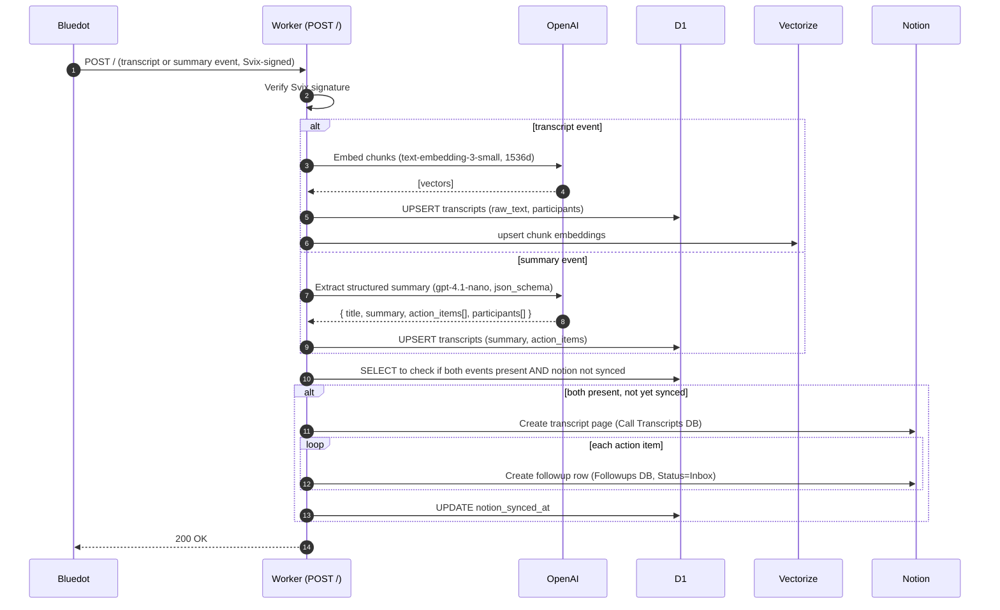
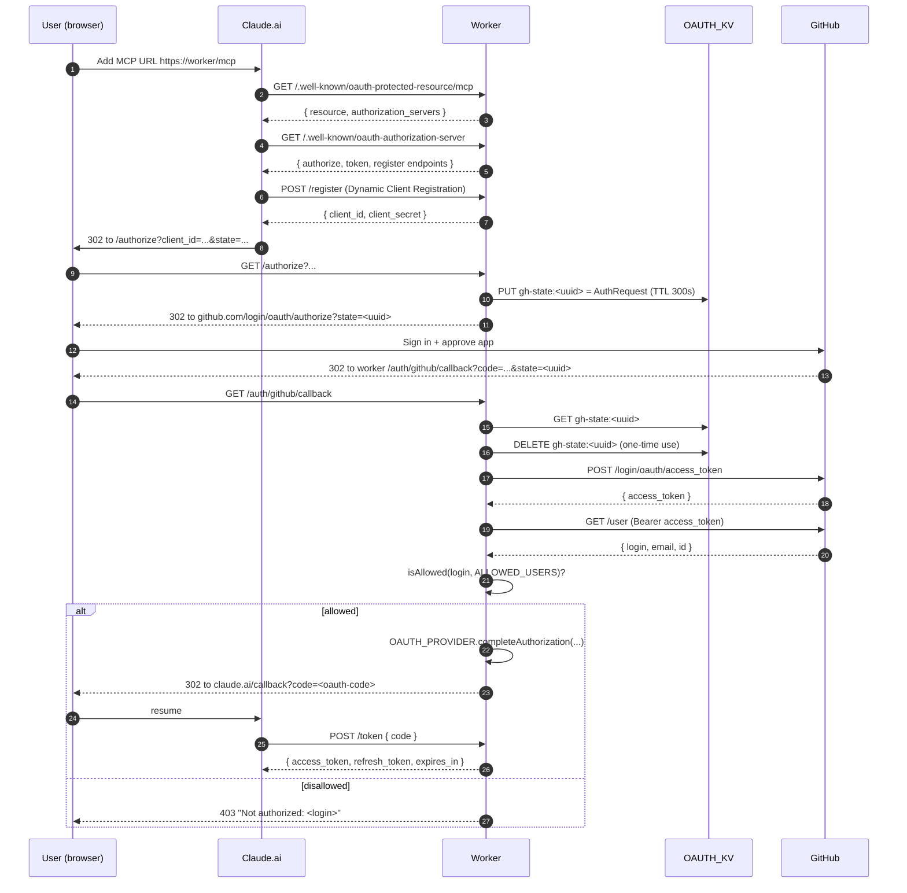
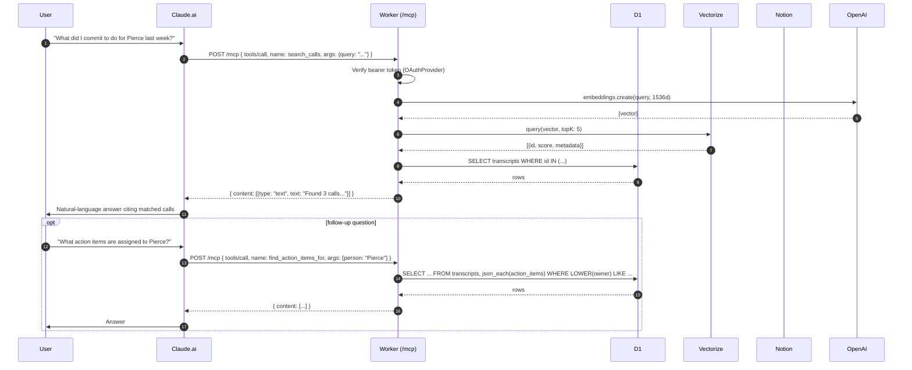

# Architecture

Three flows make up the system: **ingestion** (webhook → storage), **auth** (Claude.ai ↔ GitHub), and **query** (Claude.ai → MCP tool → storage). This doc gives a diagram for each, plus a data-model cheatsheet.

---

## 1. Ingestion pipeline

Runs every time Bluedot records a meeting. Bluedot fires two events per meeting (`video.transcript.created` + `video.summary.created`), each triggers a Worker invocation. Each event upserts the same row; idempotent on `video_id`.

Key invariants:

- D1 `UNIQUE(video_id)` dedupes at the storage layer; concurrent webhooks race into the same row without double-inserting.
- Vectorize vector IDs are deterministic (`{transcript_id}-{chunk_index}`) so retries are idempotent.
- Notion writes gate on `both_events_present && notion_synced_at IS NULL`; they happen **exactly once**.
- Notion failures are non-fatal to D1/Vectorize but return 5xx so Svix retries.

---

## 2. OAuth flow (Claude.ai ↔ GitHub)

One-time flow when a user first adds the MCP server to Claude.ai. After this, Claude.ai holds a 1-hour access token + 30-day refresh token and can talk to `/mcp` directly.

Security notes:

- `gh-state` keys have a 300s TTL and are deleted on first read; replaying a stolen state token fails.
- The Claude-side state (`state=...` query param) round-trips untouched; Claude validates it matches what it sent.
- `WWW-Authenticate: Bearer resource_metadata="..."` is emitted on every `/mcp` 401, so Claude.ai can re-discover and re-auth if a token goes bad.
- `ALLOWED_USERS` is a comma-separated allowlist; case-insensitive, whitespace-tolerant, empty/missing rejects everything (no accidental allow-all).
- `POST /auth/revoke` with `Authorization: Bearer <token>` unwraps the token and calls `revokeGrant()` — the next request with that bearer will 401.

---

## 3. MCP query path

Once connected, Claude.ai calls `tools/list` once (to see what's available) and `tools/call` per query. Each `/mcp` request is self-contained (stateless transport).

Each tool is documented in [tools.md](./tools.md) with input schema, output shape, and sample Claude.ai prompts.

---

## Data model

### D1 `transcripts` table

| Column | Type | Notes |
|--------|------|-------|
| `id` | INTEGER PK | autoincrement |
| `video_id` | TEXT UNIQUE | idempotency key from Bluedot |
| `title` | TEXT NOT NULL | meeting title |
| `raw_text` | TEXT | filled by transcript event |
| `summary` | TEXT | filled by summary event (our extraction) |
| `bluedot_summary` | TEXT | Bluedot's own summary text |
| `participants` | TEXT (JSON) | `[{name, email, role}]` |
| `action_items` | TEXT (JSON) | `[{task, owner?, due_date?}]` — targeted by `json_each` in tool queries |
| `language` | TEXT | |
| `svix_id` | TEXT | |
| `notion_page_id` | TEXT | set once Notion sync succeeds |
| `notion_synced_at` | TEXT | null until synced — gates the one-time Notion write |
| `created_at` | TEXT | default `datetime('now')` |

### Vectorize `bluedot-rag-vectors` index

- 1536 dimensions, cosine distance
- Vector ID: `{transcript_id}-{chunk_index}` (deterministic, idempotent upserts)
- Metadata: `{ transcript_id, chunk_index, chunk_text }` (chunk_text truncated to 2KB)

### Notion databases

- **Call Transcripts** (`NOTION_TRANSCRIPTS_DATA_SOURCE_ID`) — one page per meeting with summary + participants + action items
- **Followups** (`NOTION_FOLLOWUPS_DATA_SOURCE_ID`) — one row per action item, triageable inbox

### KV `OAUTH_KV`

Two key prefixes:

- `gh-state:<uuid>` — stashed Claude `AuthRequest` during the GitHub redirect (TTL 300s, one-time use)
- `oauth:*` — internal to `@cloudflare/workers-oauth-provider` (client records, grants, tokens)

---

## Design decisions worth flagging

- **GitHub OAuth over magic link.** The plan-reviewer weighed both. GitHub won on: no email infra, no CSRF surface (GitHub owns the login form), friends already have GitHub accounts, ~40% less code.
- **Stateless MCP transport.** One transport per request, no `Mcp-Session-Id` coordination. Fits CF Workers' isolate-per-request model without forcing session state into KV or a Durable Object.
- **Tool impls live as pure functions.** `src/mcp/tools/*.ts` are ordinary async functions with injectable deps. `tools.ts` registers them on `McpServer` with Zod schemas. This keeps tool logic unit-testable without loading the MCP SDK (which transitively breaks vitest-pool-workers via `ajv`).
- **Dynamic import at the MCP boundary.** `src/mcp/handler.ts` dynamically imports `./tools` so non-MCP test paths (auth handler, webhook fallback, well-known metadata) don't pull the SDK into scope.
- **No selective auth.** Every `/mcp` request requires a bearer — no carve-outs. Simpler attack surface.
